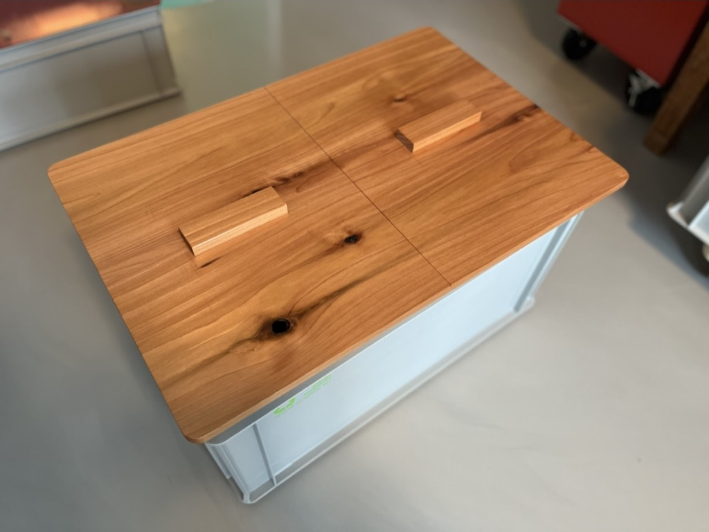
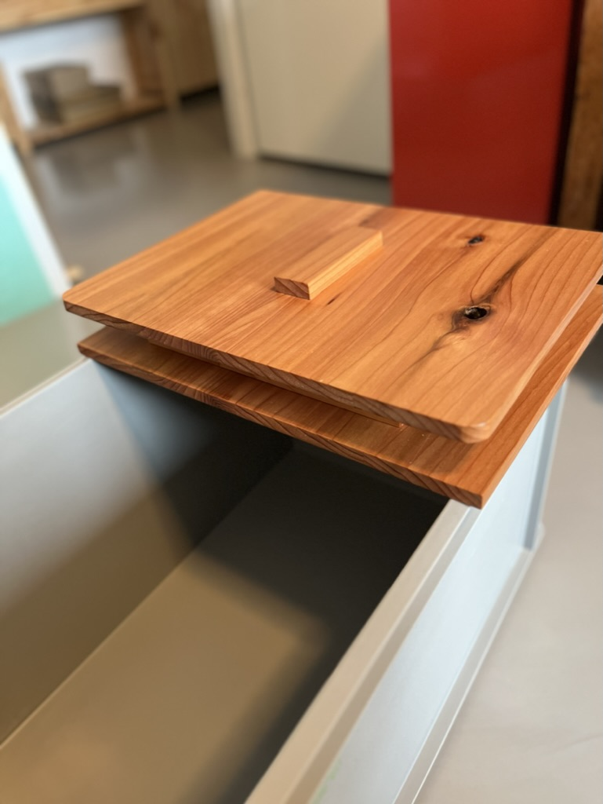

# WiggleBin

The following are steps to build our third prototype version WiggleBin V0.0.3.

## Box

### Materials
- Wood or acrylic
- Eurobox
- Oil 

### Tools
- Laser cutter

### Notes

The build for this box is open to variation. The container is a single bin worm bin made from a eurobin. The top has two lids for easy access. 

> When placing the bin inside you might want to tape off the holes with Micropore tape and add clamps to prevent worms crawling out

Vector file for lasercutting can be found in `Design/LaserCutLid`.

The lid has been oiled four times with Danish oil (with 4 hours in between) in the hope to make the Birch wood more durable and stain resistant. The oil can be applied with (paper) cloth. Make sure to read the safety instruction when using oil, since it can be a fire hazard.

### Improvements

- Using waterproof multiplex
- Enforce lid mid section 
- Air holes should be small strips instead of long stripes
- Connect and lock with square holes available in eurobox
- Make hinge with holes available in eurobox

### Alternatives

We also made some prototypes out of other materials.

*Acrylic*

Acrylic has the advantage of being to able to view the inside of the worm bin. The disadvantage is that acrylic traps moist in the worm bin. 

Another interesting side effect is that the tracks of worms on the lid become visible.

*Cedar wood*

Cedar wood has many properties which make it great for a worm bin. This type of wood is light and durable.

 