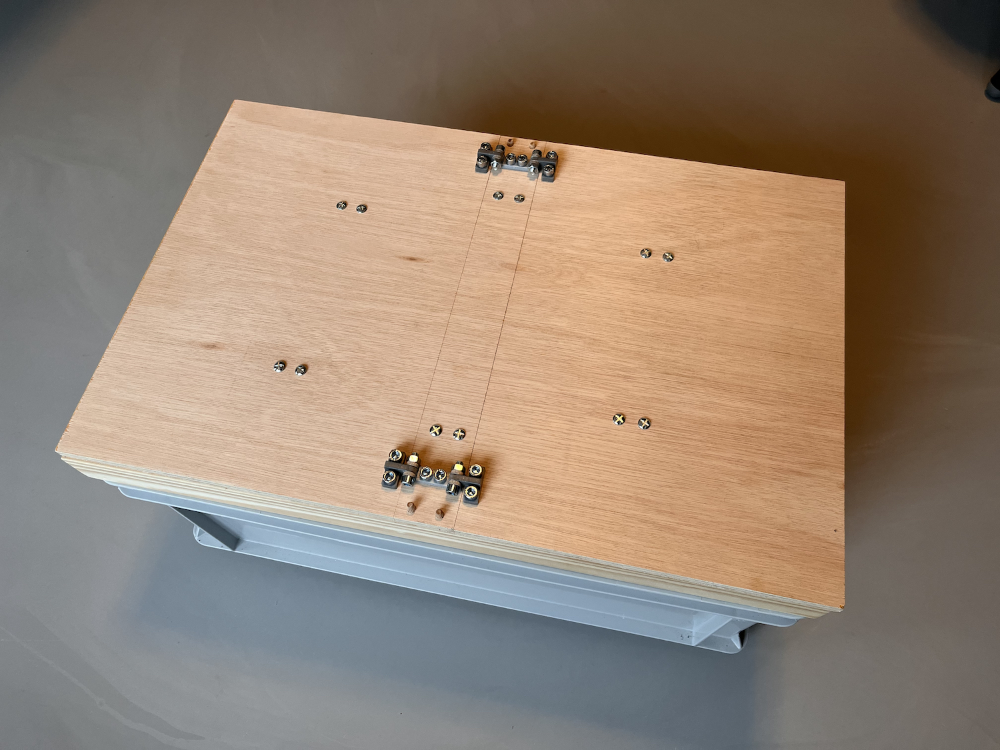

# WiggleBin Build

The following are steps to build our second prototype version WiggleBin V0.0.2.

## Box

### Materials
- Wood
- Nuts and bolts
- Dowels

### Tools
- Saw
- Drill
- Wood glue

### Notes

> We don't provide detailed documentation for this build yet as it is a prototype. The next version will contain a Lasercut and 3D file 🤞.

The build for this box is open to variation. The container is a single bin worm bin made from a eurobin. The top has two lids for easy access. Sensors can be placed under the lid (camera and distance). There is a central column in between the lids for electronics (light, soil sensor and air sensor).

3D files for hinges are available in [/Design/Hinges/](/Design/Hinges/).

Important thing is to allow for airflow without the worms escaping. This can be done by drilling holes and Micropore tape.

The box serves two purposes. 
* Easy to feed the worms
* Holds the electronics in place

## Waterproofing Soil Sensor

The soil sensor comes without protection for the circuit board. On the internet you can find many ideas for waterproofing the sensor, from nailpolish to epoxy. 

We came up with the idea of re-using a film roll case. Which provides a more elegant look and makes the sensor replacable in case of breakage.

> **Warning**
> This case is not 100% waterproof. To make it more waterproof you might want to add some hotglue in the right places. However for the worm bin we think the case is enough (time will tell).

### Materials
- Wire 
- Soil sensor
- Film roll case

### Tools
- 3D printer
- Soft hamer
- Small screwdriver (for re-opening the case when needed)
- Pliers
- Soldering station

Print the bottle cap with a 3D printer. You can download the 3D files in `Design/SoilSensorWaterProofCap`.

Take off the white connector from the soil sensor with some pliers. This will reveal additional holes. 

Place the sensor and wire into the 3D printed cap. The 3D print is designed to be super tight around the sensor and wire. Use a soft hammer to apply some pressure and kindly jam the sensor in.

Solder the wire to the sensor using the 3 holes in at the back of the sensor. 

|  |  | 
|-|-|

Place the cap on the film bottle, enjoy the snapping sound, and you're done 😅.

## Adding electronics

Work in progress...