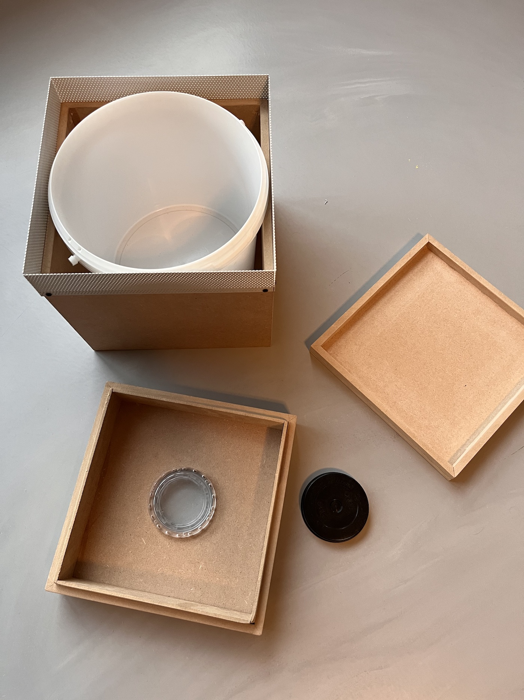
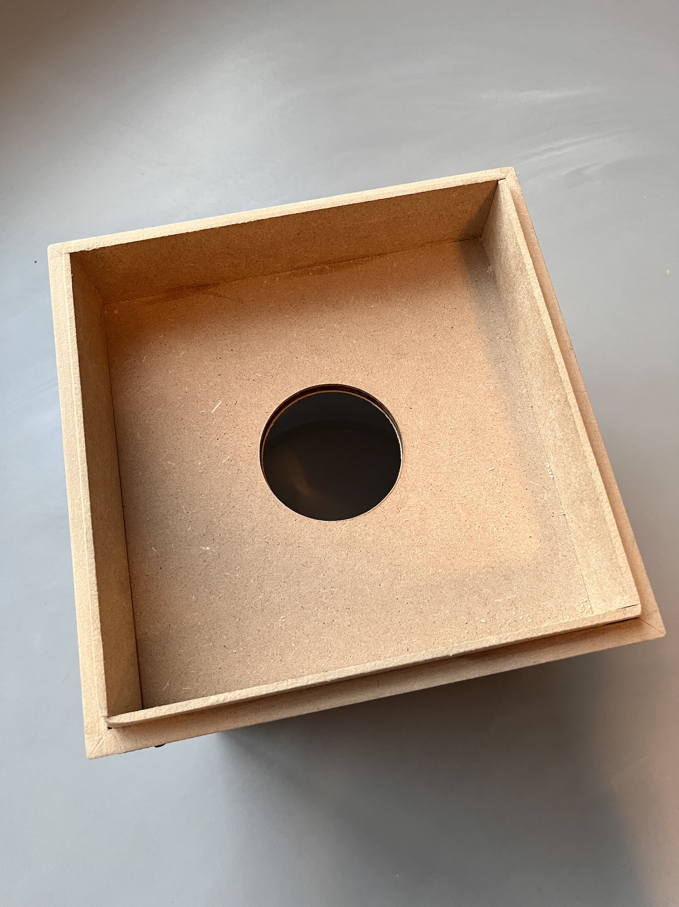
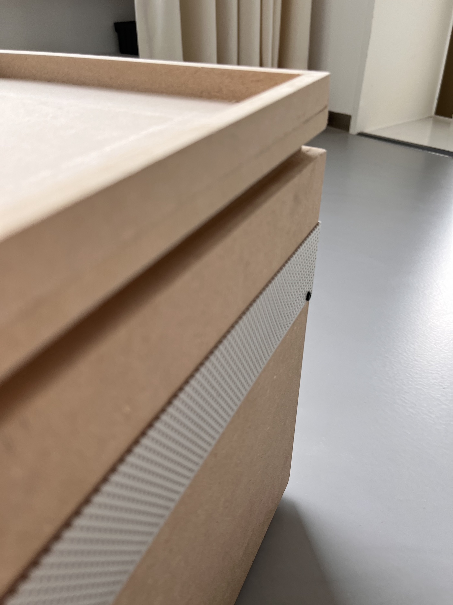

# WiggleBin Build

The following are steps to build our first prototype version WiggleBin V0.0.1.

## Box

### Materials
- Wood
- Material with small holes from [SCRAP XL in Rotterdam](http://www.scrapxl.nl/)
- Viewing window from [SCRAP XL in Rotterdam](http://www.scrapxl.nl/)
- Cap for viewing window. Taken from RISO printer cartridge.
- Small screws

### Tools
- Saw
- Drill
- Wood glue

### Notes

The build for the box is quite simple and open to variation. 

Important thing is to allow for airflow without the worms escaping. In our version we used material with small holes sourced from [SCRAP XL in Rotterdam](http://www.scrapxl.nl/).

The box serves 3 purposes. 
* Easy to make a hole for adding food and viewing window
* Holds the electronics in place
* Aesthetics

The viewing hole is 70cm which fits the viewing window and the red light ring which will be placed on the bottom.

|  |  
|-|-|

The top placed on the bucket serves as a container for electronics like the Wemos controller and battery. 

Inside the main box we place the bucket for the worms and compost.

The box for electronics is placed on top of the bucket. The viewing window and cap are placed in the middle. The cap allows access to the electronics without disturbing the worms to much with sunlight.

The box is then closed with a simple lid.

|  |  |  |
|-|-|-|

## Waterproofing Soil Sensor

## Adding electronics

