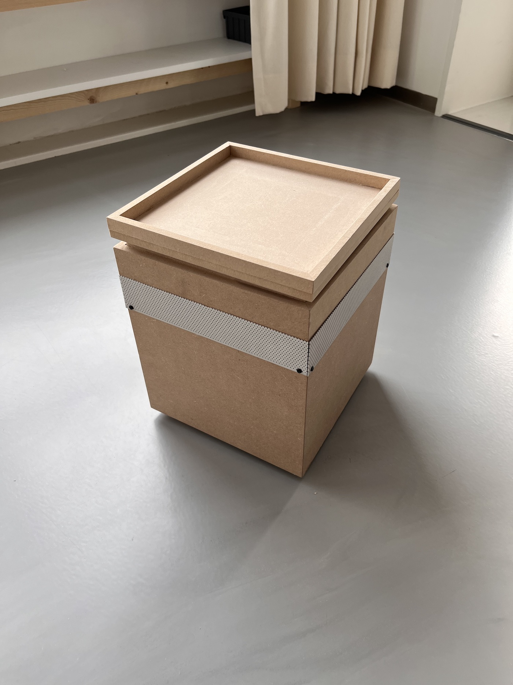
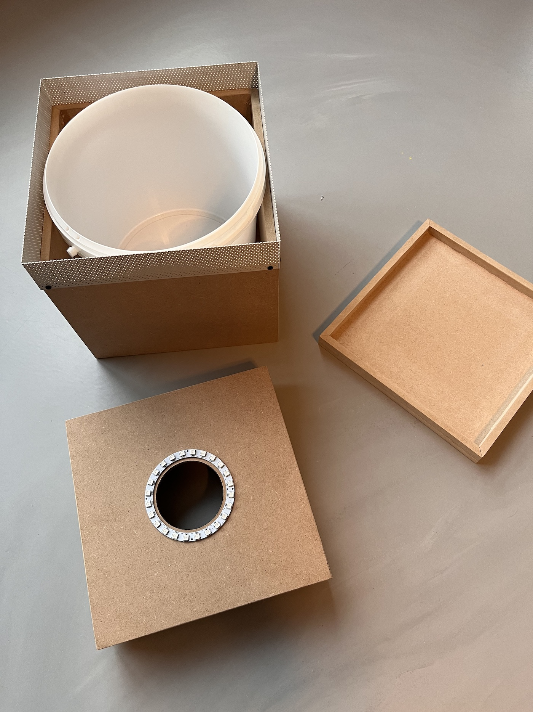
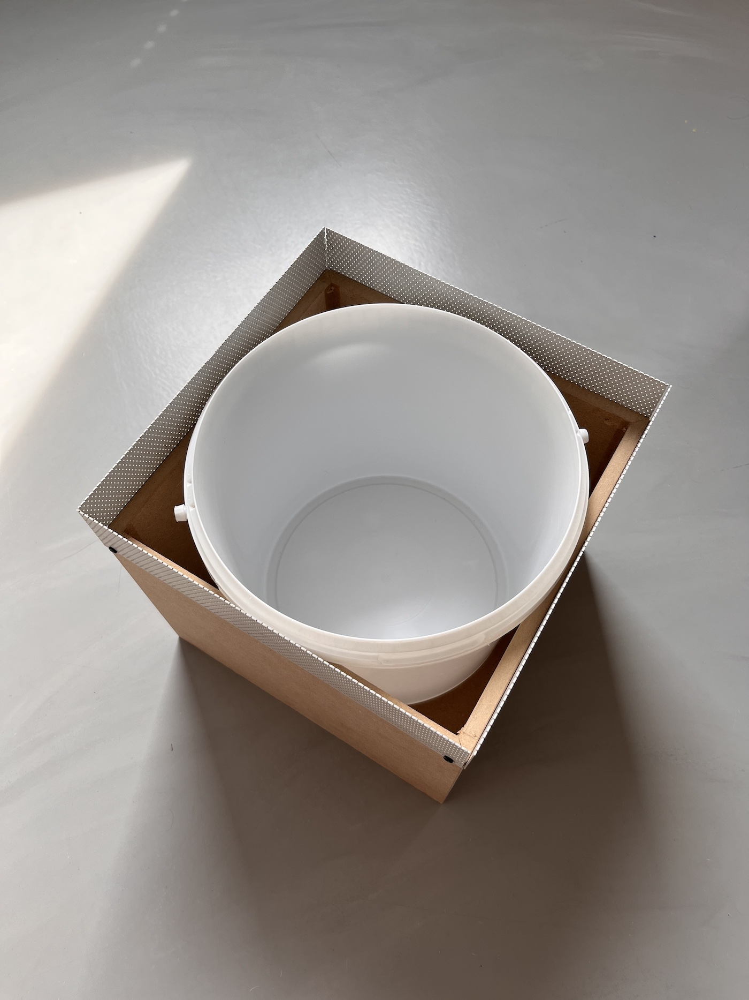
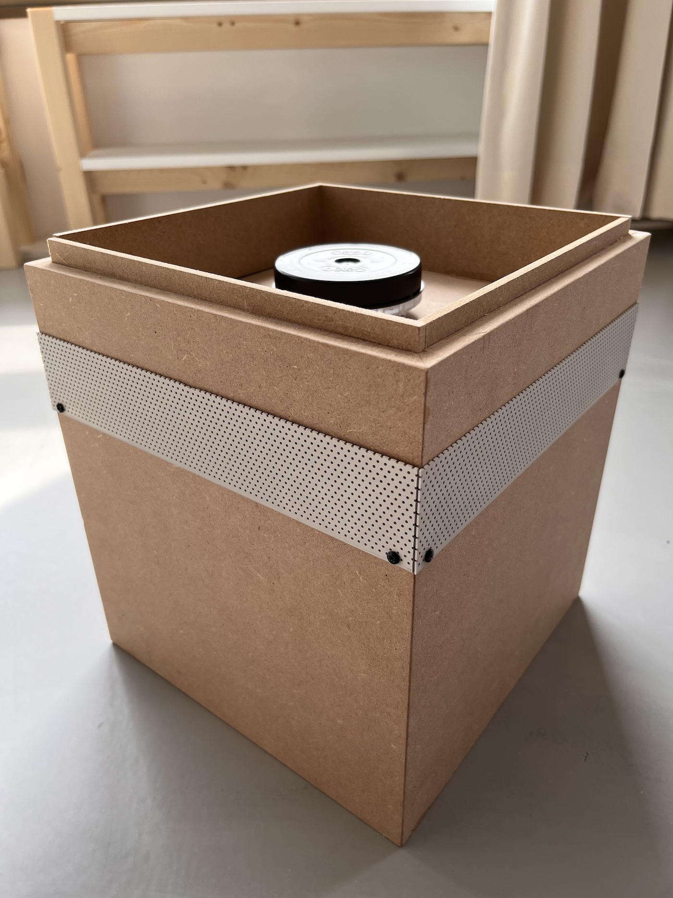
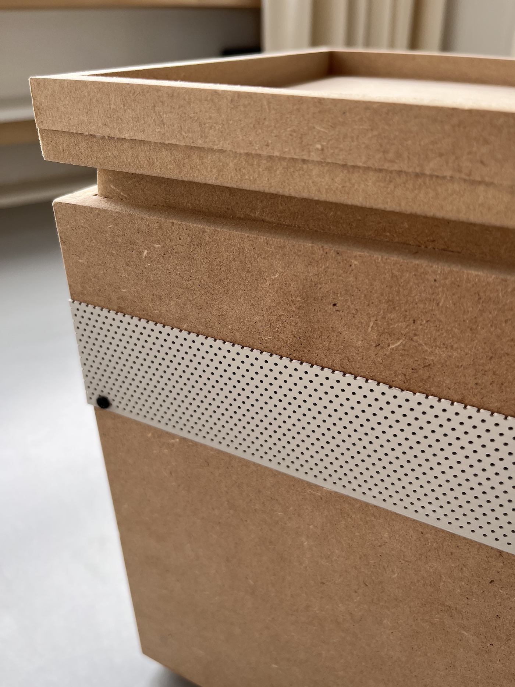
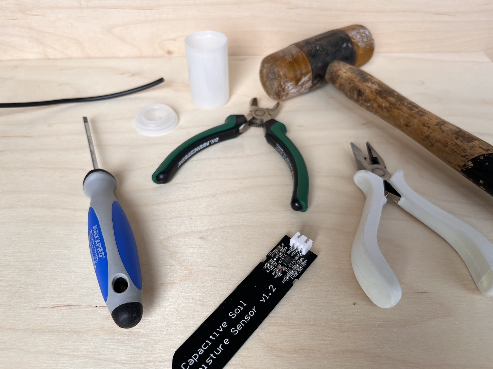
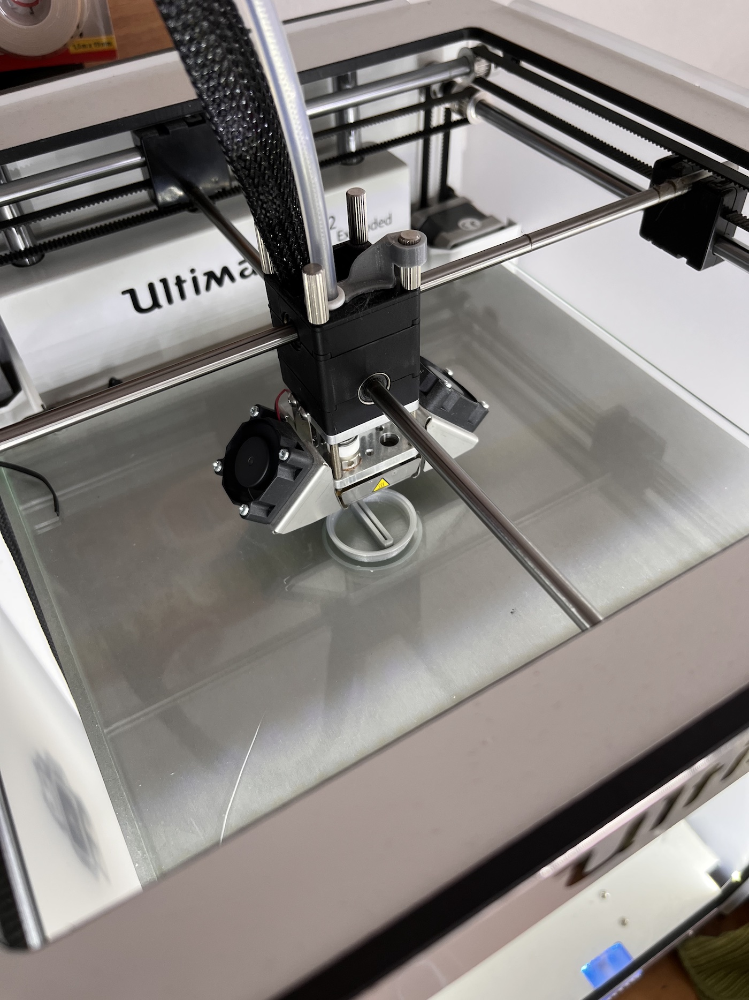
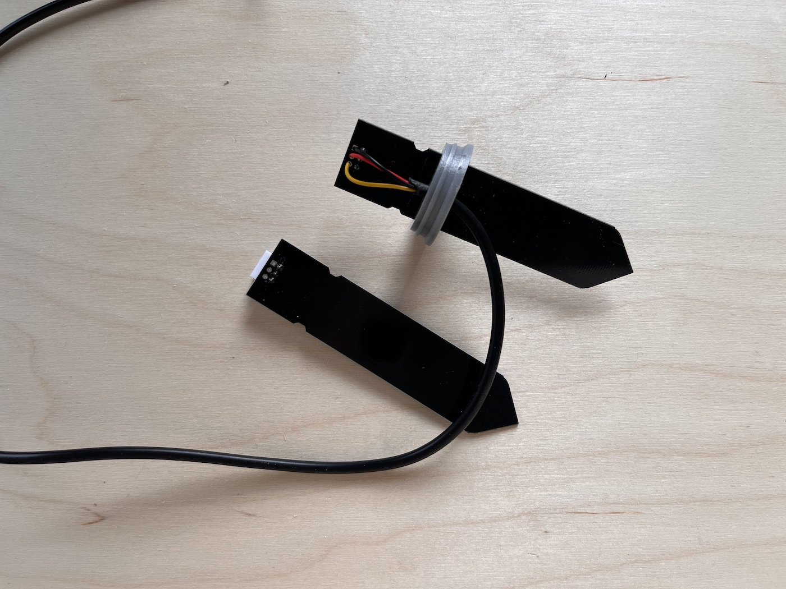

# WiggleBin Build

The following are steps to build our first prototype version WiggleBin V0.0.1.

## Box

### Materials
- Wood
- Material with small holes from [SCRAP XL in Rotterdam](http://www.scrapxl.nl/)
- Viewing window from [SCRAP XL in Rotterdam](http://www.scrapxl.nl/)
- Cap for viewing window. Taken from RISO printer cartridge.
- Small screws

### Tools
- Saw
- Drill
- Wood glue

### Notes

The build for this box is quite simple and open to variation. 

> We don't provide detailed documentation for this build yet as it is a prototype. The next version will contain a CNC and 3D file 🤞.

Important thing is to allow for airflow without the worms escaping. In our version we used material with small holes sourced from [SCRAP XL in Rotterdam](http://www.scrapxl.nl/).

The box serves 3 purposes. 
* Easy to make a hole for adding food and viewing window
* Holds the electronics in place
* Aesthetics

The viewing hole is 70mm which fits the viewing window and the red light ring which will be placed on the bottom.

|  |  
|-|-|

The top placed on the bucket serves as a container for electronics like the Wemos controller and battery. 

Inside the main box we place the bucket for the worms and compost.

The box for electronics is placed on top of the bucket. The viewing window and cap are placed in the middle. The cap allows access to the electronics without disturbing the worms to much with sunlight.

The box is then closed with a simple lid.

|  |  |  |
|-|-|-|

## Waterproofing Soil Sensor

The soil sensor comes without protection for the circuit board. On the internet you can find many ideas for waterproofing the sensor, from nailpolish to epoxy. 

We came up with the idea of re-using a film roll case. Which provides a more elegant look and makes the sensor replacable in case of breakage.

> **Warning**
> This case is not 100% waterproof. To make it more waterproof you might want to add some hotglue in the right places. However for the worm bin we think the case is enough (time will tell).

### Materials
- Wire 
- Soil sensor
- Film roll case

### Tools
- 3D printer
- Soft hamer
- Small screwdriver (for re-opening the case when needed)
- Pliers
- Soldering station

Print the bottle cap with a 3D printer. You can download the Fusion 360 and STL file in `Design/SoilSensorWaterProofCap`.

Take off the white connector from the soil sensor with some pliers. This will reveal additional holes. 

Place the sensor and wire into the 3D printed cap. Solder the wire to the sensor.

|  |  | 
|-|-|

Place the cap on the top and you're done 😅.

## Adding electronics

Work in progress...