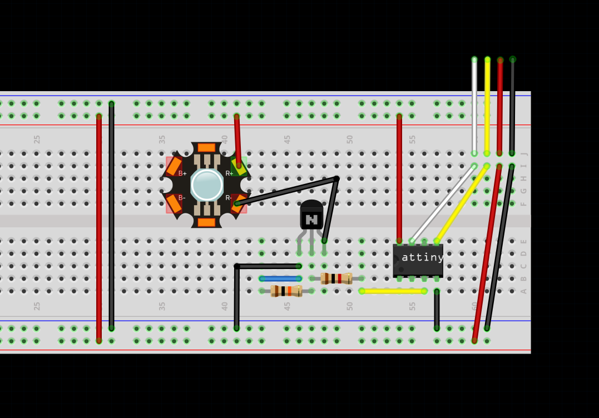

# WiggleBin I2C Sensors

The following is a guide on how to make sensors and actuators available for the M5Stack camera by programming Attiny45 chips with an I2C address. 

See complete HomeAssistant/EspHome config in [/Code/EspHome/I2CSensors/wigglebin.yaml](/Code/EspHome/I2CSensors/wigglebin.yaml)

> Not using HomeAssistant? Arduino code is available under [/Code/Arduino/WiggleBin/I2CSensors](/Code/Arduino/WiggleBin/I2CSensors)

### WiggleBin Light 

- Attiny45 (Attiny85 should also work)
- High power LED
- Q1S8050 NPN Transistor
- 10kΩ resistor
- 1kΩ resistor

The WiggleBin Light uses an Attiny45 chip to control an LED via I2C on address 13.

The Attiny chip can be [programmed with an Arduino](https://www.instructables.com/Program-an-ATtiny44458485-with-Arduino/). Arduino code is available under [/Code/Arduino/WiggleBinLight/](/Code/Arduino/WiggleBinLight/)


Fritzing file is available in [Design/WiggleBinLight/WiggleBinLightI2C.fzz](Design/WiggleBinLight/WiggleBinLight.fzz)

We also need to add the WiggleBin Light as a component to EspHome. Save the following code in `config/esphome/WiggleBinLightComponent.h` on the Raspberry Pi.

```c++
#include "esphome.h"

using namespace esphome;

class WiggleBinLight : public Component, public FloatOutput {
 public:
  void setup() override {
    Wire.begin();
  }

  void write_state(float state) override {
    // state is the amount this output should be on, from 0.0 to 1.0
    // we need to convert it to an integer first
    int value = state * 255;
    Wire.beginTransmission(13);
    Wire.write(value);
    Wire.endTransmission();
  }
};
```

Change the configuration of WiggleBin to include this new component. 

```yaml
esphome:
  name: "wigglebin"
  includes:
    - WiggleBinLightComponent.h

light:
  - platform: monochromatic
    name: "WiggleBin Light"
    output: wiggleBinLight
    default_transition_length: 0s

output:
- platform: custom
  type: float
  lambda: |-
    auto wiggle_bin_light_output = new WiggleBinLight();
    App.register_component(wiggle_bin_light_output);
    return {wiggle_bin_light_output};
  outputs:
    id: wiggleBinLight
```

### WiggleBin Soil Sensor

The WiggleBin Soil Sensor measures the soil temperature and moisture.

- Attiny45 (Attiny85 should also work)
- [Capacitive Soil Moisture sensor](https://www.tinytronics.nl/shop/en/sensors/liquid/capacitive-soil-moisture-sensor-module-with-cable). Make sure to buy a [good one](https://www.youtube.com/watch?v=IGP38bz-K48).
- [1MΩ resistor](https://www.tinytronics.nl/shop/en/components/resistors/resistors/1m%CF%89-resistor)
- [DS18B20 TO-92 Thermometer](https://www.tinytronics.nl/shop/en/sensors/temperature/ds18b20-to-92-thermometer-temperature-sensor-with-cable-waterproof-high-temperature-1m) (soil temperature)
- [DS18B20 Adapter](https://www.tinytronics.nl/shop/en/sensors/temperature/ds18b20-adapter) or 4.7kΩ resistor

The WiggleBin Soil Sensor uses an Attiny45 chip to make soil sensor and moisture data available over I2C on address 8.


Fritzing file is available in [Design/WiggleBinSoilSensor/WiggleBinSoilSensor.fzz](/Design/WiggleBinSoilSensor/WiggleBinSoilSensor.fzz)

The Attiny chip can be [programmed with an Arduino](https://www.instructables.com/Program-an-ATtiny44458485-with-Arduino/). Arduino code is available under [/Code/Arduino/WiggleBinSoilSensor](/Code/Arduino/WiggleBinSoilSensor)

We also need to add the WiggleBin Soil Sensor as a component to EspHome. Save the following code in `config/esphome/WiggleBinSoilSensorComponent.h` on the Raspberry Pi.

```c++
#include "esphome.h"

using namespace esphome;

typedef struct {
  byte soilMoist;
  float soilTemp;
} SoilSensorData_t;

typedef union FloatToBytes_t 
{ 
  float f; 
  char b[sizeof(float)]; 
};

#define PACKET_SIZE 5

bool getSoilData(SoilSensorData_t* soilSensor);

class WiggleBinSoilSensor : public PollingComponent, public Sensor {
 public:
  WiggleBinSoilSensor() : PollingComponent(15000) {}

  float get_setup_priority() const override { return esphome::setup_priority::BUS; }

  void setup() override {
    Wire.begin();
  }

  void write_state(float state) override {
    SoilSensorData_t soilSensor; 
    if(getSoilData( &soilSensor )) {
        publish_state(soilSensor.soilMoist);
    }
  }
};

bool getSoilData(SoilSensorData_t* soilSensor)
{
  bool gotI2CPacket = false;  
  byte index = 0;
  byte I2C_Packet[PACKET_SIZE];

  Wire.requestFrom(soilSensordResponderAddress, PACKET_SIZE);
  
  while (Wire.available()){
      I2C_Packet[index++] = Wire.read();
      gotI2CPacket = true;
  }

  if(gotI2CPacket) {
      gotI2CPacket = false;

      soilSensor->soilMoist = I2C_Packet[0];
      
      FloatToBytes_t soilTemp;
      soilTemp.b[0] = I2C_Packet[1];
      soilTemp.b[1] = I2C_Packet[2];
      soilTemp.b[2] = I2C_Packet[3];
      soilTemp.b[3] = I2C_Packet[4];
    
      soilSensor->soilTemp = soilTemp.f;

      return true;
   } else { 
    return false; 
   }
}
```

Change the configuration of WiggleBin to include this new component.

```yaml
esphome:
  name: "wigglebin"
  includes:
    - WiggleBinSoilSensorComponent.h

sensor:
- platform: custom
  lambda: |-
    auto wiggle_bin_soil_sensor = new WiggleBinSoilSensor();
    App.register_component(wiggle_bin_soil_sensor);
    return {wiggle_bin_soil_sensor};

  sensors:
    name: "Wiggle Bin Soil Sensor"
```
