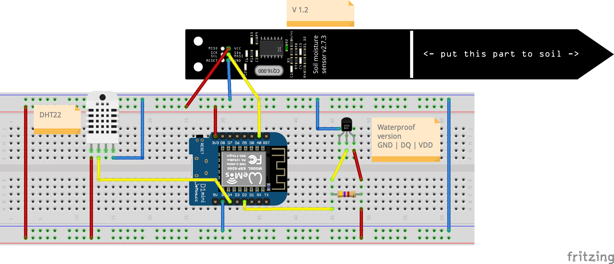
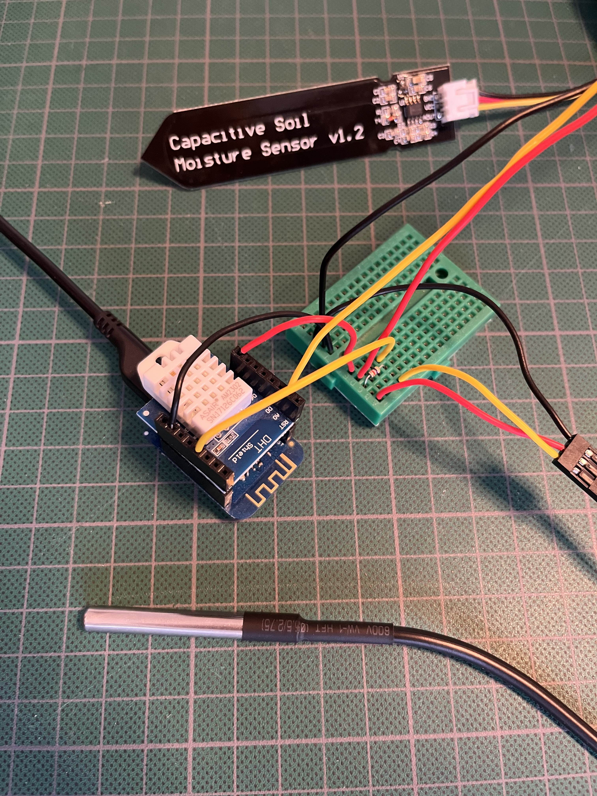

# "Hello" Worm Electronics

## Materials
- [D1 Mini](https://www.tinytronics.nl/shop/en/development-boards/microcontroller-boards/with-wi-fi/d1-mini-esp8266-12f-ch340) or any other ESP8266 device
- [Capacitive Soil Moisture sensor](https://www.tinytronics.nl/shop/en/sensors/liquid/capacitive-soil-moisture-sensor-module-with-cable)
- [1MΩ resistor](https://www.tinytronics.nl/shop/en/components/resistors/resistors/1m%CF%89-resistor)
- [DS18B20 TO-92 Thermometer](https://www.tinytronics.nl/shop/en/sensors/temperature/ds18b20-to-92-thermometer-temperature-sensor-with-cable-waterproof-high-temperature-1m) (soil temperature)
- [DS18B20 Adapter](https://www.tinytronics.nl/shop/en/sensors/temperature/ds18b20-adapter) or  4.7kΩ resistor
- [DHT22 Thermometer](https://www.tinytronics.nl/shop/en/sensors/air/humidity/dht22-thermometer-temperature-and-humidity-sensor-module-with-cables) (temperature and humidity)

## Equipment

- Soldering iron
- DuPont wires

## Connecting the sensors

Setup the D1 Mini to be compatible with the Arduino IDE. Follow [these steps](https://github.com/esp8266/Arduino#installing-with-boards-manager).

Connect the sensors. Fritzing file is available in [Design/HelloWorm.fzz](Design/HelloWorm.fzz)

Code is available in [Code/Arduino/HelloWorm](Code/Arduino/HelloWorm).