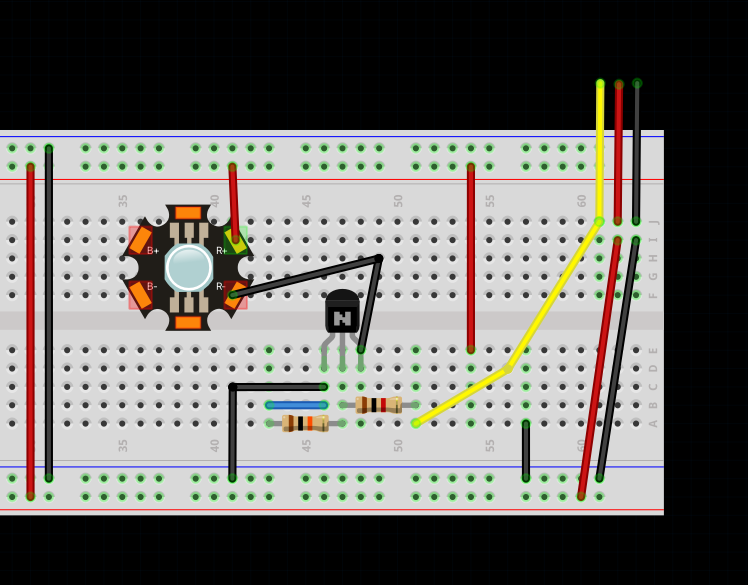

# WiggleBin Electronics

## WiggleBin Home and Central

### Materials
- [M5Stack Timer Camera F - Fisheye](https://www.tinytronics.nl/shop/en/platforms-and-systems/m5stack/camera/m5stack-timer-camera-f-fisheye) or Raspberry Pico W or ESP device.
- [M5STACK FlashLight Unit - AW3641](https://www.tinytronics.nl/shop/en/platforms-and-systems/m5stack/unit/m5stack-flashlight-unit-aw3641) - be aware that worms are sensitive to light
- Raspberry Pi to run [Home Assistant](https://webthings.io) and collect data

### WiggleHome: Showing data

The Raspberry Pi with [Home Assistant](https://webthings.io) installed acts as a home to collect and display sensor info. Home Assistant can also trigger alerts when a sensor passes a certain value, perfect for detecting unhappy worms.

Follow the [Home Assistant start guide](https://www.home-assistant.io/installation/) to set up a Home Assistant station.

After installing Home Assistant follow the [ESPHome start guide](https://esphome.io/guides/getting_started_hassio.html).

### WiggleBin Central: Connecting the WiggleBin sensors with WiggleHome

WiggleBin can be made with or without a camera. This document describes the WiggleBin with a M5Stack camera connected to sensors and actuators over I2C. When no camera is needed a Raspberry Pico W or ESP device can be used instead.

This is the YAML config for HomeAssistant/EspHome.

> Not using HomeAssistant? Arduino code is available under [/Code/WiggleBinCentral/](/Code/WiggleBinCentral/)

```yaml
esphome:
  name: "WiggleBin"

esp32:
  board: esp32dev
  framework:
    type: arduino

i2c:
  sda: GPIO4
  scl: GPIO13
  scan: True

esp32_camera:
  external_clock:
    pin: GPIO27
    frequency: 20MHz
  i2c_pins:
    sda: GPIO25
    scl: GPIO23
  data_pins: [GPIO32, GPIO35, GPIO34, GPIO5, GPIO39, GPIO18, GPIO36, GPIO19]
  vsync_pin: GPIO22
  href_pin: GPIO26
  pixel_clock_pin: GPIO21
  reset_pin: GPIO15
  contrast: 1
  brightness: 1
  name: WiggleCamera
```

## WiggleBin Sensors

### WiggleBin Light

Having a light in the WiggleBin can be handy for monitoring the worm bin via the camera or when feeding the worms. Worms are sensitive to light, but are okay with red and infrared light. Therefore this unit uses a red LED.

- Attiny45 (Attiny85 should also work)
- High power LED
- Q1S8050 NPN Transistor
- 10kΩ resistor
- 1kΩ resistor

The WiggleBin Light uses an Attiny45 chip to control an LED via I2C on address 13.

The Attiny chip can be [programmed with an Arduino](https://www.instructables.com/Program-an-ATtiny44458485-with-Arduino/). Arduino code is available under [/Code/WiggleBinLight/](/Code/WiggleBinLight/)


Fritzing file is available in [Design/WiggleBinLight/WiggleBinLight.fzz](Design/WiggleBinLight/WiggleBinLight.fzz)

We also need to add the WiggleBin Light as a component to   EspHome. Save the following code in `config/esphome/WiggleBinLightComponent.h` on the Raspberry Pi.

```c++
#include "esphome.h"

using namespace esphome;

class WiggleBinLight : public Component, public FloatOutput {
 public:
  void setup() override {
    Wire.begin();
  }

  void write_state(float state) override {
    // state is the amount this output should be on, from 0.0 to 1.0
    // we need to convert it to an integer first
    int value = state * 255;
    Wire.beginTransmission(13);
    Wire.write(value);
    Wire.endTransmission();
  }
};
```

Change the configuration of WiggleBin Central to include this new component. 

```yaml
esphome:
  name: "WiggleBin"
  includes:
    - WiggleBinLightComponent.h

light:
  - platform: monochromatic
    name: "WiggleBin Light"
    output: wiggleBinLight
    default_transition_length: 0s

output:
- platform: custom
  type: float
  lambda: |-
    auto wiggle_bin_light_output = new WiggleBinLight();
    App.register_component(wiggle_bin_light_output);
    return {wiggle_bin_light_output};
  outputs:
    id: wiggleBinLight
```

### WiggleBin Soil Sensor

The WiggleBin Soil Sensor measures the soil temperature and moisture.

- Attiny45 (Attiny85 should also work)
- [Capacitive Soil Moisture sensor](https://www.tinytronics.nl/shop/en/sensors/liquid/capacitive-soil-moisture-sensor-module-with-cable). Make sure to buy a [good one](https://www.youtube.com/watch?v=IGP38bz-K48).
- [1MΩ resistor](https://www.tinytronics.nl/shop/en/components/resistors/resistors/1m%CF%89-resistor)
- [DS18B20 TO-92 Thermometer](https://www.tinytronics.nl/shop/en/sensors/temperature/ds18b20-to-92-thermometer-temperature-sensor-with-cable-waterproof-high-temperature-1m) (soil temperature)
- [DS18B20 Adapter](https://www.tinytronics.nl/shop/en/sensors/temperature/ds18b20-adapter) or 4.7kΩ resistor

The WiggleBin Soil Sensor uses an Attiny45 chip to make soil sensor and moisture data available over I2C on address 8.


Fritzing file is available in [Design/WiggleBinSoilSensor/WiggleBinSoilSensor.fzz](/Design/WiggleBinSoilSensor/WiggleBinSoilSensor.fzz)

The Attiny chip can be [programmed with an Arduino](https://www.instructables.com/Program-an-ATtiny44458485-with-Arduino/). Arduino code is available under [/Code/WiggleBinSoilSensor](/Code/WiggleBinSoilSensor)

### WiggleBin Air Sensor

- [BME680 sensor](https://www.tinytronics.nl/shop/en/sensors/air/pressure/bme680-sensor-module-with-level-converter-air-pressure-air-quality-humidity-temperature)

The BME680 sensor is used to measure things like temperature and moisture in the air. The BME680 is available via I2C at address 0x77.

## WiggleBin Outdoor

Because the WiggleBin will usually be placed outside in the garden or balcony we will eventually add the option to make it battery powered. This chapter is however work in progress.

Now batteries are not great for nature (chemicals and such). Therefore we created an experimental adapter which can be 3D printed and holds multiple types of batteries re-used from that old phone in your cabinet.

The 3D files for this can be found in `Design/WiggleBinV001/BatteryHolder`.

Wire the wires trough the holes and tighten the battery in with a bolt.

> **Warning**
> Batteries can be dangerous. Please be careful and only proceed when you have enough electronics experience. Otherwise use a battery supply off the shelf of an electronics store or a 5V wall adapter.

|  |  | 
|-|-|