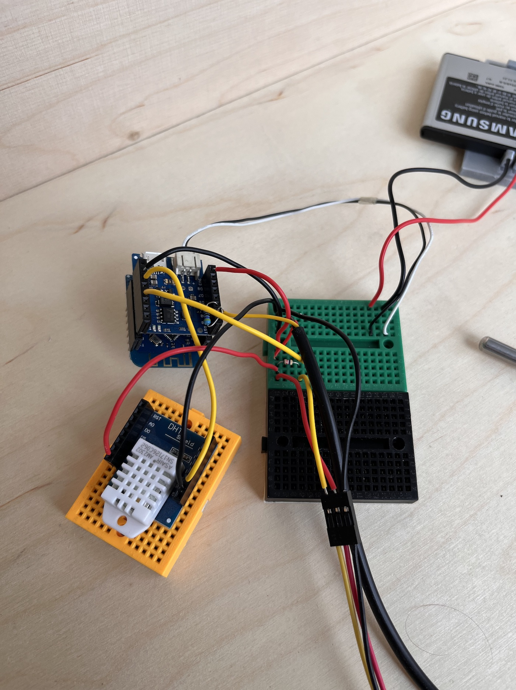
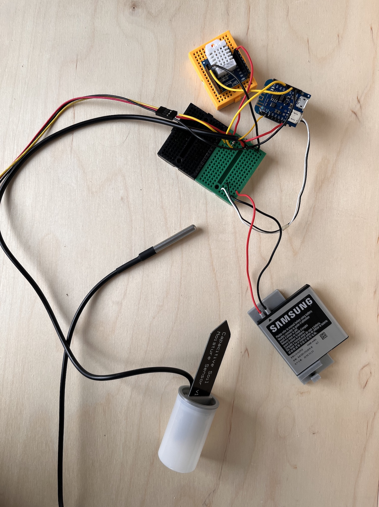
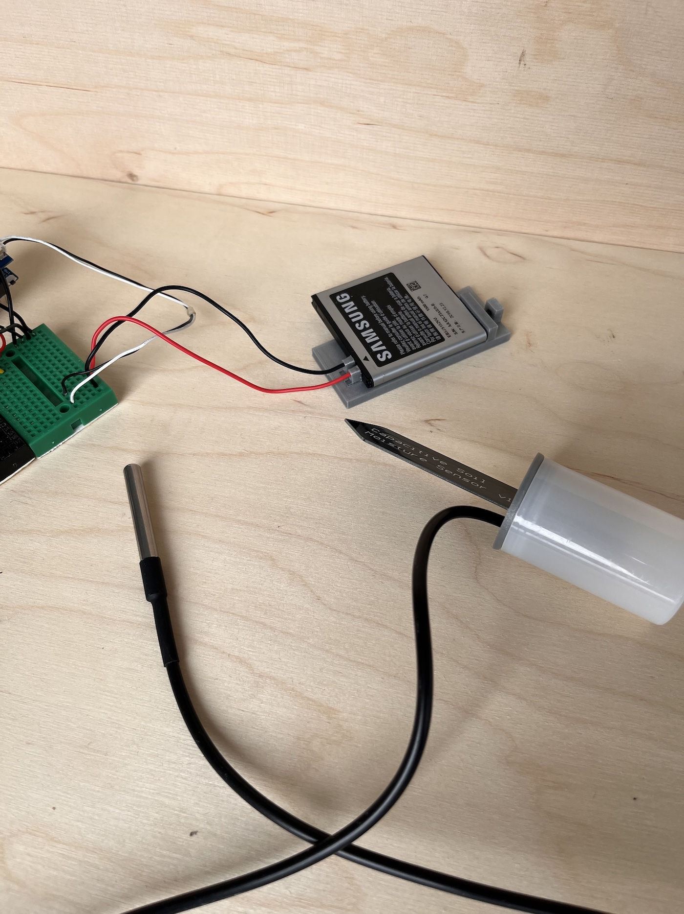
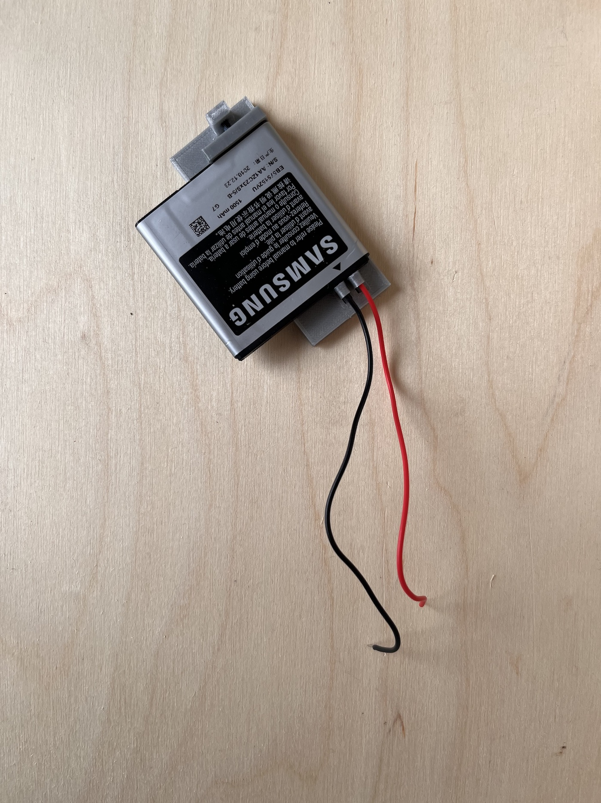
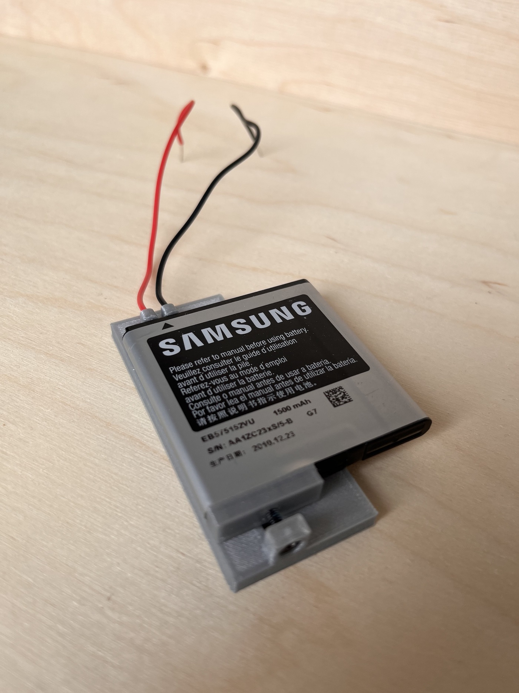
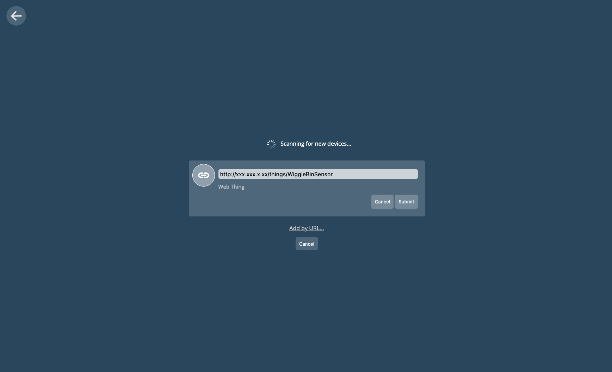
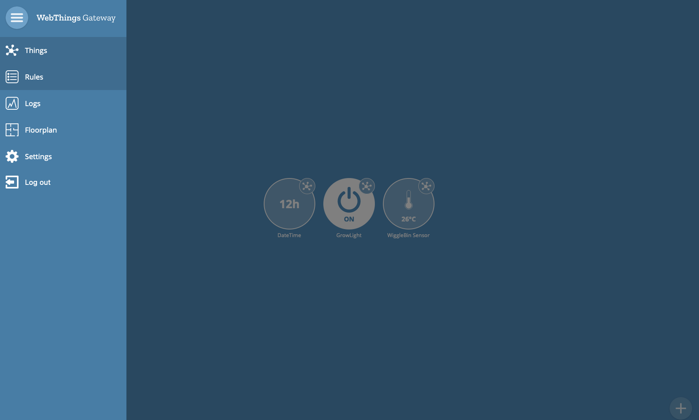
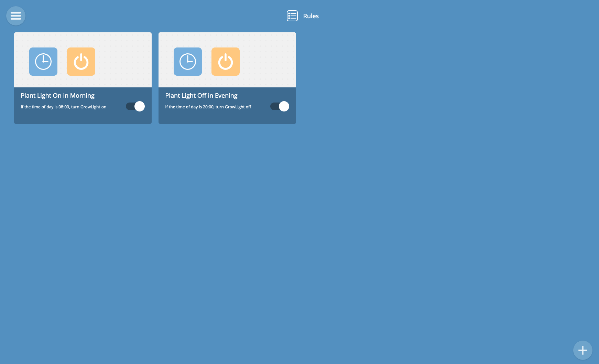
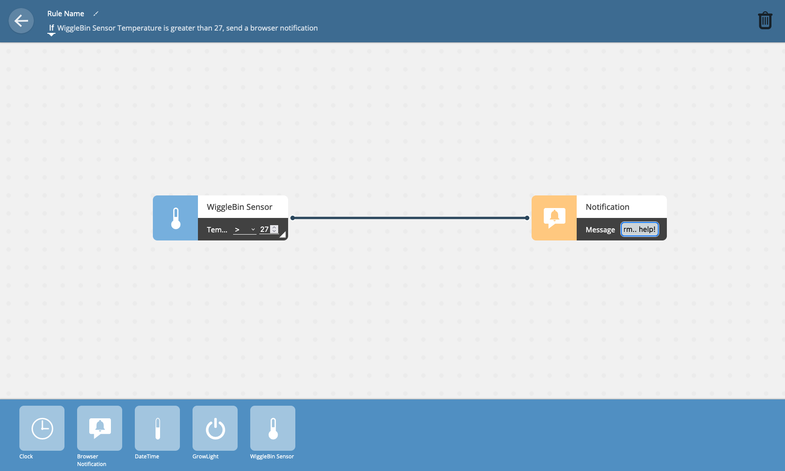
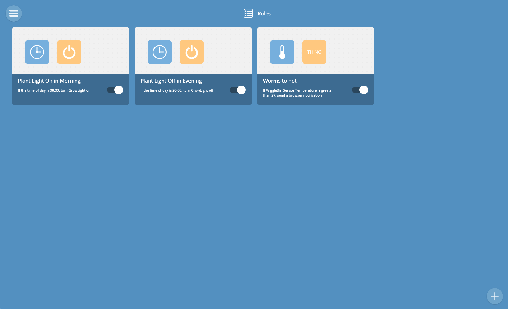

# WiggleBin Electronics

## WiggleBin Sensors

### Materials
- [D1 Mini](https://www.tinytronics.nl/shop/en/development-boards/microcontroller-boards/with-wi-fi/d1-mini-esp8266-12f-ch340) or any other ESP8266 device
- [Capacitive Soil Moisture sensor](https://www.tinytronics.nl/shop/en/sensors/liquid/capacitive-soil-moisture-sensor-module-with-cable). Make sure to buy a good one - https://www.youtube.com/watch?v=IGP38bz-K48.
- [1MΩ resistor](https://www.tinytronics.nl/shop/en/components/resistors/resistors/1m%CF%89-resistor)
- [DS18B20 TO-92 Thermometer](https://www.tinytronics.nl/shop/en/sensors/temperature/ds18b20-to-92-thermometer-temperature-sensor-with-cable-waterproof-high-temperature-1m) (soil temperature)
- [DS18B20 Adapter](https://www.tinytronics.nl/shop/en/sensors/temperature/ds18b20-adapter) or  4.7kΩ resistor
- [DHT22 Thermometer](https://www.tinytronics.nl/shop/en/sensors/air/humidity/dht22-thermometer-temperature-and-humidity-sensor-module-with-cables) (temperature and humidity)

### Equipment

- Soldering iron
- DuPont wires

### Connecting the sensors

Setup the D1 Mini to be compatible with the Arduino IDE. Follow [these steps](https://github.com/esp8266/Arduino#installing-with-boards-manager).

Connect the sensors on the breadboard according to the schematic below.


Fritzing file is available in [Design/HelloWorm.fzz](Design/HelloWorm.fzz)

Here are some real life pictures for reference.

|  |  | 
|-|-|-|

Upload the code from [Code/WiggleBinSerial](Code/WiggleBinSerial). You can now view the incoming data from the Arduino Serial Monitor.

### Battery

Because the WiggleBin will usually be placed outside in the garden or balcony we added the option to make it battery powered.

Now batteries are not great for nature (chemicals and such). Therefore we created an experimental adapter which can be 3D printed and holds multiple types of batteries re-used from that old phone in your cabinet.

The 3D files for this can be found in `Design/WiggleBinV001/BatteryHolder`.

Wire the wires trough the holes and tighten the battery in with a bolt.

> **Warning**
> Batteries can be dangerous. Please be careful and only proceed when you have enough electronics experience. Otherwise use a battery supply off the shelf of an electronics store or a 5V wall adapter.

|  |  | 
|-|-|

## WiggleBin Central

To collect data from the WiggleBin Sensors we need a central unit. 

The Raspberry Pi with [WebThings](https://webthings.io) installed acts as a central unit to display sensor info. WebThings can also trigger alerts when a sensor passes a certain value, perfect for detecting unhappy worms.

> **Warning**
> Currently we are working [on a blocker issue](https://github.com/studiorabota/wiggle-bin/issues/13 ) which causes WebThings not to update sensor data

### Materials
- Raspberry Pi

### WebThings on Raspberry Pi

Follow the [WebThings start guide](https://webthings.io/docs/gateway-getting-started-guide.html) to set up a WebThings station.

### Making the Wemos a WebThing

Download files from [Code/WiggleBinWebThings](Code/WiggleBinWebThings). Change the name from `NetworkSettingsSample.h` to `NetworkSettings.h` and fill in your Wifi SSID and password. Upload the `WiggleBinWebThings.ino` code to Wemos via Arduino IDE.

Check out the Arduino Serial Monitor. You should see a message like this. 

```
12:59:34.953 -> Connected to [...]
12:59:34.953 -> IP address: xxx.xxx.x.xx
12:59:34.953 -> MDNS responder started
12:59:35.003 -> HTTP server started
12:59:35.003 -> http://xxx.xxx.x.xx/things/WiggleBinSensor
12:59:35.743 -> Update send to WebThings
12:59:36.248 -> Deep Sleep
```

### Adding WiggleBin to WebThings

Navigate to `https://[your name].webthings.io` (or `http://gateway.local` depending on your setup) in the browser.

You should now see this screen from WebThings.


The device can only be added when the Wemos is not in sleeping. Keep an eye on your Arduino Serial Monitor and hit the plus button (right bottom) when it says `HTTP server started` in the Arduino Serial Monitor.

WebThings will start looking for the WiggleBin sensor. Unfortunaly this process often fails. To solve this click on `Add by URL...`.


Copy the URL from the Arduino Serial monitor.

```
12:59:35.003 -> http://xxx.xxx.x.xx/things/WiggleBinSensor
```

Paste the url and click `Submit`.



You should now see the WiggleBin sensor. Press `Save` and `Done` to add the device to WebThings.


The sensor is now visible in the overview and already showing the temperature.


Click on the spidery icon to display all WiggleBin sensor info. So cool! Happy worms 🪱.


### Setting up alerts

Click on the burger menu in the left top and open the `Rules` window.


 
You should now see this Rules screen. Click on the plus (right bottom) to add a new rule.



Drag the WiggleBin sensor to the left of the screen. Set for example the temperature to a maximum of 27 degrees.


Drag the browser notification to the right of the screen and write a message like 🪱 "Tooo hot! Help!".

Change the Rule Name to "Worms too hot" and click on the back arrow (left top). 



The rule is now added to WebThings and should alert you when worms are overheating.



### Saving battery life

The code is set to send an update every 1 minute for testing purposes on first install. You probably want to change this to something like 30 minutes and safe battery life. Also the delay can be reduced between sending the update and placing the ESP in sleep 😴.

```C
delay(50000);

Serial.println("Deep Sleep");
ESP.deepSleep(1*60*1000000); // 1 minute slee
```

### Debugging

Something does not work! Mmmhh.. try the following.

Go to http://xxx.xxx.x.xx/things/WiggleBinSensor/properties in the browser. Check if the values appear correctly. You might have to refresh a couple of times because of a sleepy Wemos.


