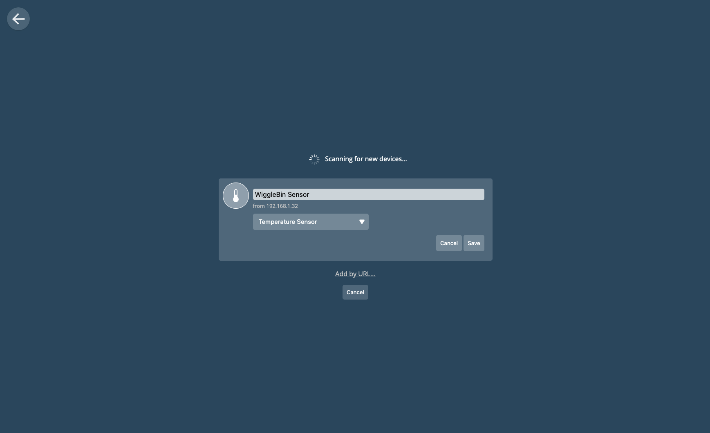
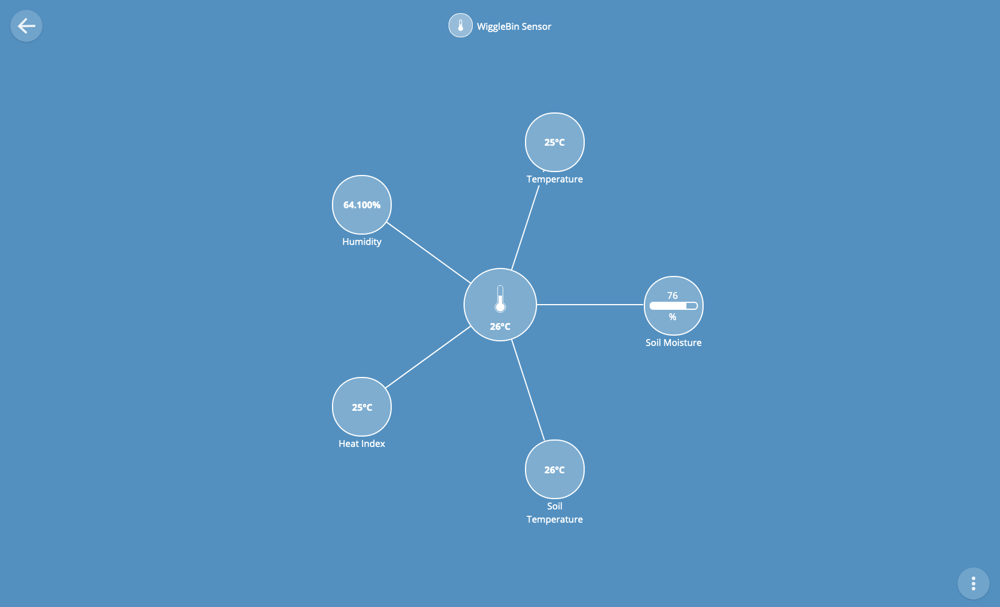

# WiggleBin Electronics

## WiggleBin Sensors

### Materials
- [D1 Mini](https://www.tinytronics.nl/shop/en/development-boards/microcontroller-boards/with-wi-fi/d1-mini-esp8266-12f-ch340) or any other ESP8266 device
- [Capacitive Soil Moisture sensor](https://www.tinytronics.nl/shop/en/sensors/liquid/capacitive-soil-moisture-sensor-module-with-cable). Make sure to buy a good one - https://www.youtube.com/watch?v=IGP38bz-K48.
- [1MΩ resistor](https://www.tinytronics.nl/shop/en/components/resistors/resistors/1m%CF%89-resistor)
- [DS18B20 TO-92 Thermometer](https://www.tinytronics.nl/shop/en/sensors/temperature/ds18b20-to-92-thermometer-temperature-sensor-with-cable-waterproof-high-temperature-1m) (soil temperature)
- [DS18B20 Adapter](https://www.tinytronics.nl/shop/en/sensors/temperature/ds18b20-adapter) or  4.7kΩ resistor
- [DHT22 Thermometer](https://www.tinytronics.nl/shop/en/sensors/air/humidity/dht22-thermometer-temperature-and-humidity-sensor-module-with-cables) (temperature and humidity)

### Equipment

- Soldering iron
- DuPont wires

### Connecting the sensors

Setup the D1 Mini to be compatible with the Arduino IDE. Follow [these steps](https://github.com/esp8266/Arduino#installing-with-boards-manager).

Connect the sensors. Fritzing file is available in [Design/HelloWorm.fzz](Design/HelloWorm.fzz)


Upload the code from [Code/WiggleBinSerial](Code/WiggleBinSerial). You can now view the incoming data from the Arduino Serial Monitor.

## WiggleBin Central

To collect data from the WiggleBin Sensors we need a central unit. 

The Raspberry Pi with [WebThings](https://webthings.io) installed acts as a central unit to display sensor info. WebThings can also trigger alerts when a sensor passes a certain value, perfect for detecting unhappy worms.

> **Warning**
> Currently we are working [on a blocker issue](https://github.com/studiorabota/wiggle-bin/issues/13 ) which causes WebThings not to update sensor data

Follow the [WebThings start guide](https://webthings.io/docs/gateway-getting-started-guide.html) to set up a WebThings station.
Upload the code from [Code/WiggleBinWebThings](Code/WiggleBinWebThings).

Change the name from `NetworkSettingsSample.h` to `NetworkSettings.h` and fill in your Wifi SSID and password.

Check out the Arduino Serial Monitor. You should see a message like this. 

```
12:59:34.953 -> Connected to [...]
12:59:34.953 -> IP address: xxx.xxx.x.xx
12:59:34.953 -> MDNS responder started
12:59:35.003 -> HTTP server started
12:59:35.003 -> http://xxx.xxx.x.xx/things/WiggleBinSensor
12:59:35.743 -> Update send to WebThings
12:59:36.248 -> Deep Sleep
```

Navigate to `https://[your name].webthings.io` or `http://gateway.local` in the browser depending on your setup.

You should now see this screen from WebThings. Mine already has some things installed. Your screen will probably empty.


The device can only be added when the Wemos is not in sleeping. Keep an eye on your monitor and hit the plus button (right bottom) when it says `HTTP server started` in the Arduino Serial Monitor.

WebThings will start looking for the WiggleBin sensor. Unfortunaly this process often fails. To solve this click on `Add by URL...`.


Copy the URL from the Arduino Serial monitor.

```
12:59:35.003 -> http://xxx.xxx.x.xx/things/WiggleBinSensor
```

Paste the url and click `Submit`.


You should now see the WiggleBin sensor. Press `Save` and `Done` to add the device to WebThings.



The sensor is now visible in the overview and already showing the temperature.


Click on the spidery icon to display all WiggleBin sensor info. So cool! Happy worms 🪱.



The code is set to send an update every 1 minute for testing purposes on first install. You probably want to change this to something like 30 minutes and safe battery life. Also the delay can be reduced between sending the update and placing the ESP in sleep 😴.

```C
delay(50000);

Serial.println("Deep Sleep");
ESP.deepSleep(1*60*1000000); // 1 minute slee
```


