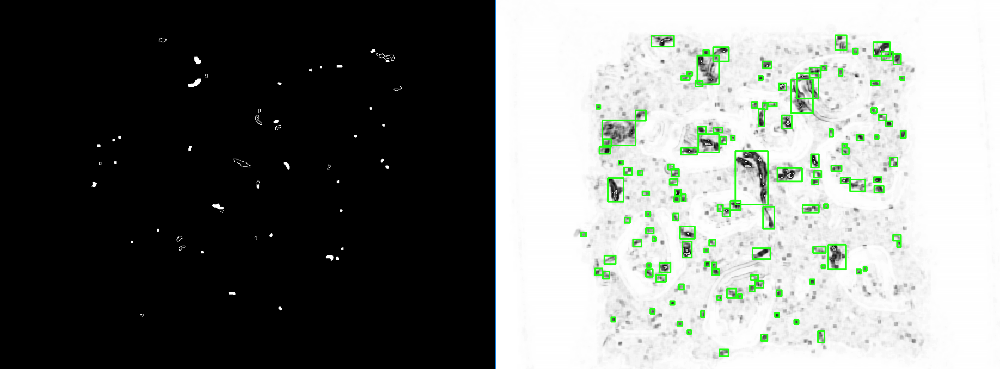

# WiggleBin

The mission of WiggleBin is to craft an **open-source, intelligent [vermicomposting](https://en.wikipedia.org/wiki/Vermicompost) bin** that cultivates joy for both earthworms and their human stewards. 

Yet, delving into the essence of worm happiness raises intriguing queries: What defines a worm's contentment? How can we gauge their emotional state? Moreover, how do these fascinating creatures navigate and perceive their surroundings through their unique sensory mechanisms?

To engineer a composting haven attuned to the intricacies of the [Umwelt](https://en.wikipedia.org/wiki/Umwelt) (perceptual world) of the Red Wiggler ([Eisenia fetida](https://en.wikipedia.org/wiki/Eisenia_fetida)) and the European Nightcrawler ([Dendrobaena hortensis](https://en.wikipedia.org/wiki/Dendrobaena_hortensis)), we embark on a journey of exploration, mapping, and sensory observation. 

With the patience reminiscent of Darwinian pursuits, we diligently test and scrutinize their behavior, employing a fusion of time-honored methods and cutting-edge technologies such as electronic sensors and rapid prototyping tools. 

This holistic approach allows us to unravel the secrets of our cherished wigglers, paving the way for a composting bin that harmonizes with their natural tendencies and fosters a symbiotic relationship with human caretakers.

## Why?

Managing a worm bin comes with its share of challenges. Worms may decide to make a hasty escape, contend with overheating, or face the risk of drying out. As a caring caretaker, your priority is ensuring the well-being of your worms. 

But here's the conundrum: how do you ascertain the happiness of your worms without the need for daily disruptions, minimizing disturbance to the worms, and avoiding the inconvenience of soiled hands?

 Here are some of the common problems.
- Overheating
- Drowning
- Too wet
- Too dry
- Lack of oxygen
- Over or under feeding
- Feeding the wrong food

## How?

The central focus of our initiative is [WiggleR](./WiggleR/README.md)—an uncomplicated and user-friendly desktop composting bin designed for controlled experiments.

Complementing this flagship project, we've developed several smaller, yet significant sub-projects:

1. WiggleGate (Soon to be released): A specialized sensor engineered to detect worm movement.
2. [WiggleAlert](./WiggleAlert/README.md): An alert system crafted to signal any signs of discomfort or unhappiness among the worms.
3. [WiggleBin](./WiggleBin/README.md): A straightforward and easily manageable worm bin, ideal for both creation and maintenance.

## License

The WiggleBin is open source hardware. Hardware is covered under CERN-OHL-S-2.0 (`LICENSE.CERN-OHL-S-2.0.txt`) license and software under GPL-3.0-or-later (`LICENSE.GPL-3.0-or-later.txt`) license.

## Status

This project is in the research and testing phase. Currently our research involves trying out different sensors. See [issues](https://github.com/studiorabota/wiggle-bin/issues) for more info and how to contribute. Check [milestones](https://github.com/studiorabota/wiggle-bin/milestones) for our future plans.

## Thanks!

Many thanks to [Open Hardware Academy](https://www.openhardware.academy/01_Welcome.html) and [Stadslab Rotterdam](https://stadslabrotterdam.nl/) for making this build possible.