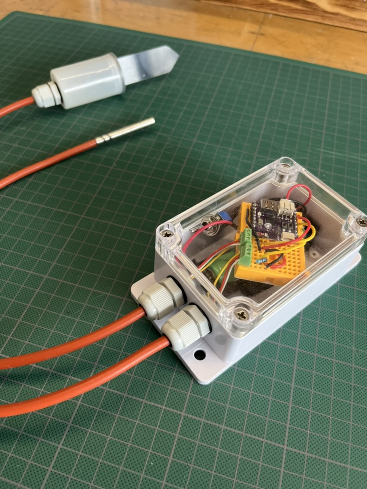
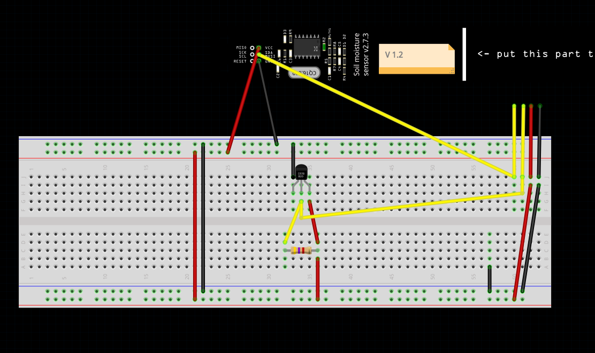
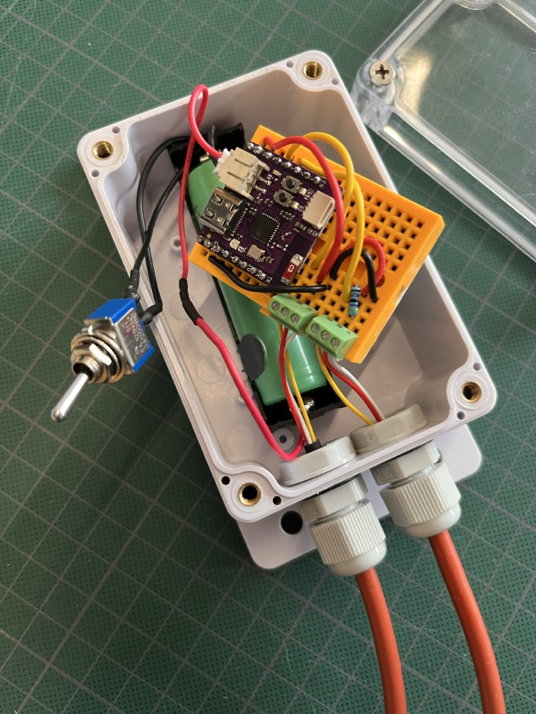
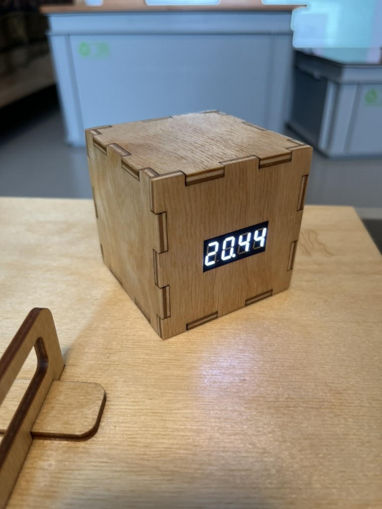
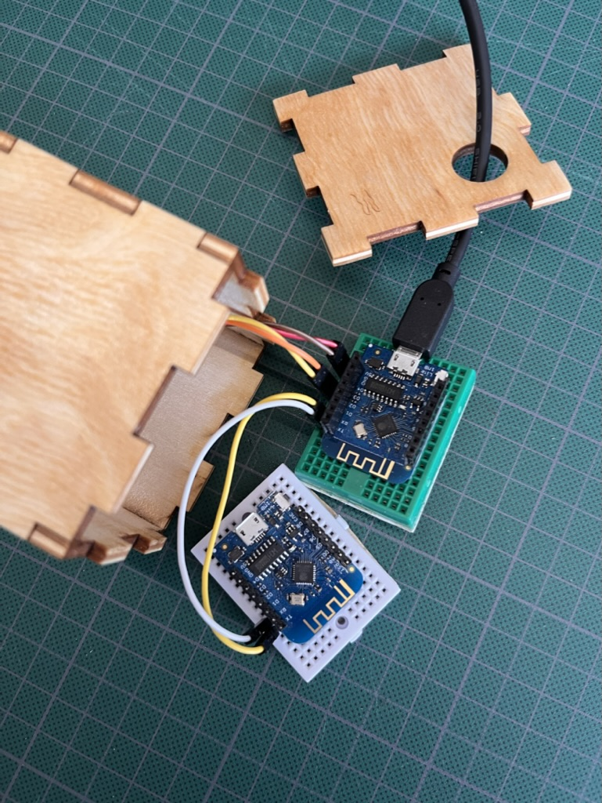
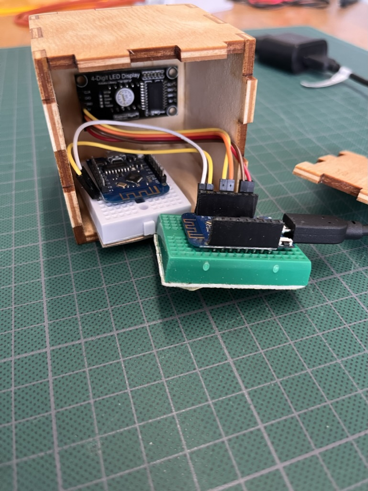
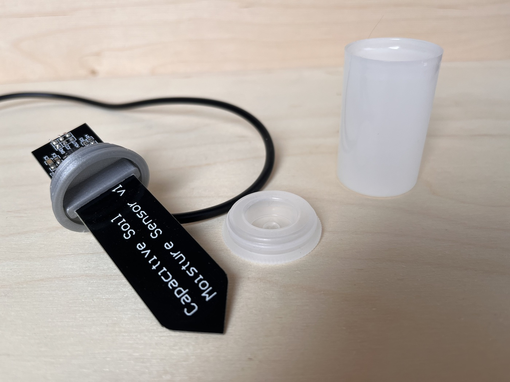

# WiggleAlert

The following are steps to build our first prototype version WiggleAlert V0.0.1. WiggleAlert is a system to monitor your worm bin and notify you when worms are not happy.

 

## Sensors

 

Arduino code can be found in [Code](./Code) folder

### Electronics

The WiggleAlert sensor box measures the soil temperature and moisture and sends this to the display over EspNOW.

- [Wemos ESP32-Pico](https://www.tinytronics.nl/shop/nl/development-boards/microcontroller-boards/met-wi-fi/wemos-c3-pico-esp32-c3-v1.0.0)
- [18650 battery holder](https://www.tinytronics.nl/shop/nl/power/batterijhouders-en-clips/18650/1x-18650-batterijhouder-klemcontacten-draden-per-cel)
- [Waterproof enclosure](https://www.tinytronics.nl/shop/nl/gereedschap-en-montage/behuizingen/universeel/sonoff-ip66-waterdichte-behuizing)
- [Capacitive Soil Moisture sensor](https://www.tinytronics.nl/shop/en/sensors/liquid/capacitive-soil-moisture-sensor-module-with-cable). Make sure to buy a [good one](https://www.youtube.com/watch?v=IGP38bz-K48).
- [1MΩ resistor](https://www.tinytronics.nl/shop/en/components/resistors/resistors/1m%CF%89-resistor)
- [DS18B20 TO-92 Thermometer](https://www.tinytronics.nl/shop/en/sensors/temperature/ds18b20-to-92-thermometer-temperature-sensor-with-cable-waterproof-high-temperature-1m) (soil temperature)
- [DS18B20 Adapter](https://www.tinytronics.nl/shop/en/sensors/temperature/ds18b20-adapter) or 4.7kΩ resistor

| Wemos ESP32-Pico | Sensor
--- | --- | 
| A0 | Capacitive Soil Moisture sensor |
| 1 | DS18B20 |
| 3V3(Out) | 
| GND | 

 

 

## Display

 

### Electronics
- Wemos Mini
- Optional second Wemos Mini to send data to EspHome
- 4 digit display

### Materials
- Wood 4mm
- Wood glue
- Oil

### Code
Arduino code can be found in [Code](./Code) folder

### Build

Lasercut file can be found in [Design/DigitLedDisplayBox](./Design/DigitLedDisplayBox)

### Connections
 

 

## Waterproofing Soil Sensor

The soil sensor comes without protection for the circuit board. On the internet you can find many ideas for waterproofing the sensor, from nailpolish to epoxy. 

We came up with the idea of re-using a film roll case. Which provides a more elegant look and makes the sensor replacable in case of breakage.

> **Warning**
> This case is not 100% waterproof. To make it more waterproof you might want to add some hotglue in the right places. However for the worm bin we think the case is enough (time will tell).

> **Warning**
> Inserting the sensor trough the cap can damage the sensor. We still need to make some improvements to the design.

### Materials
- Wire 
- Soil sensor
- Film roll case

### Tools
- 3D printer
- Soft hamer
- Small screwdriver (for re-opening the case when needed)
- Pliers
- Soldering station

3D files for Raspberry Pico holder with breadboard are available in 

Print the bottle cap with a 3D printer. You can download the 3D files in `Design/SoilSensorWaterProofCap`.

Take off the white connector from the soil sensor with some pliers. This will reveal additional holes. 

Place the sensor and wire into the 3D printed cap. The 3D print is designed to be super tight around the sensor and wire. Use a soft hammer to apply some pressure and kindly jam the sensor in.

Solder the wire to the sensor using the 3 holes in at the back of the sensor. 

|  |  | 
|-|-|

Place the cap on the film bottle, enjoy the snapping sound, and you're done 😅.