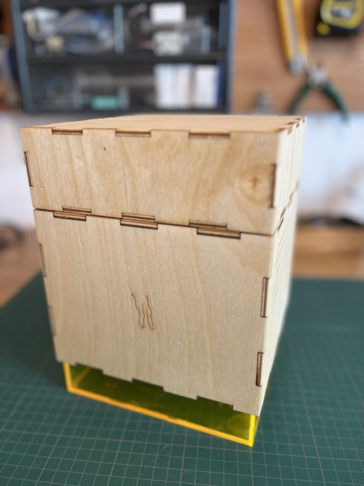
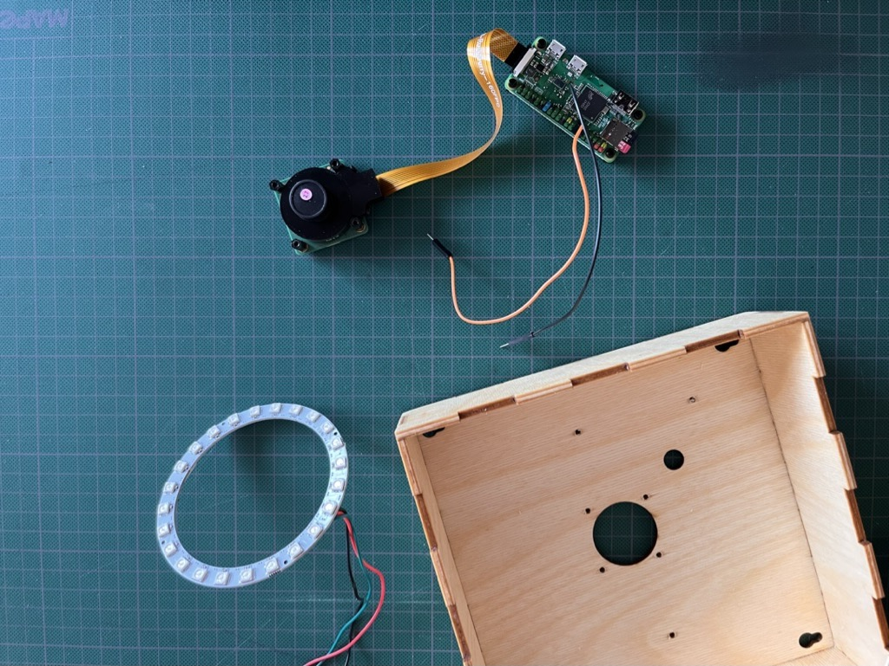
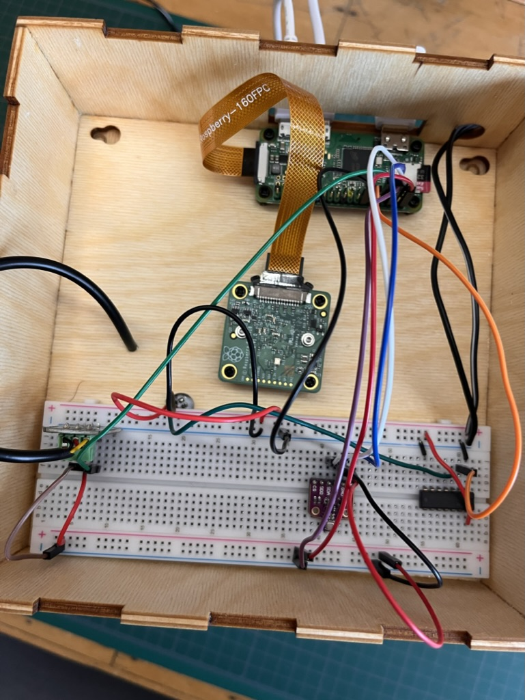

# WiggleR

The following are steps to build our first prototype version WiggleR V0.0.1. WiggleR is a desktop research unit for making controlled experiments with worms. WiggleR can also be used inside the WiggleBin.

## Box

### Materials
- Wood or acrylic
- Oil
- Wood glue (or even better, waterproof glue)
- Instant glue

### Tools
- Laser cutter

### Build

Vector file for lasercutting can be found in the [`Design`](./Design/) folder.

WiggleR consists of an acrylic base for keeping soil and worms. A wooden seperator to create distance between camera and worms. Wooden top for electronics.

Wooden panel can be glued together. Add tape to keep parts together while the glue dries.

Acrylic has been glued with instant glue. More suitable glues are probably available, however it is only version 0.0.1 :).

Birch wood has been oiled on the outside with cooked lineseed oil and danish oil on the inside. Oil can be applied with (paper) cloth. Make sure to read the safety instruction when using oil, since it can be a fire hazard.

### Improvements

- Using waterproof multiplex or acrylic
- Lasercut file does not contain holes for RP HQ camera bolts, RP zero bolts and sensors
- Port holes in back can be more precise
- Needs bottom unit
- Bottom unit with backlight would be nice

## Electronics

### Materials

- [Raspberry Zero](https://www.kiwi-electronics.com/nl/raspberry-pi-zero-wh-header-voorgesoldeerd-3328)
- [Raspberry HQ Camera](https://www.kiwi-electronics.com/nl/raspberry-pi-hq-camera-m12-mount-11243)
- [Raspberry Zero Adapters](https://www.kiwi-electronics.com/nl/raspberry-pi-zero-adapter-pack-2844)
- [Raspberry Zero Camera Adapter](https://www.kiwi-electronics.com/nl/raspberry-pi-zero-camera-adapter-2842)
- [Lens](https://www.kiwi-electronics.com/nl/m12-high-resolution-lens-12mp-113-fov-2-7mm-focal-length-11266)
- [M2.5 spacers](https://www.kiwi-electronics.com/nl/m2-5-schoeven-en-afstandshouders-set-zwart-nylon-380-stuks-10252?search=spacer&page=2)
- [Led Ring](https://www.tinytronics.nl/shop/nl/verlichting/ringen-en-modules/ sk6812-digitale-5050-rgb-led-ring-24-leds-wit)
- [ADS1115](https://www.tinytronics.nl/shop/nl/sensoren/stroom-spanning/ads1115-16-bit-adc-i2c-module-4-kanaals)
- [Capacitive Soil Moisture sensor](https://www.tinytronics.nl/shop/en/sensors/liquid/capacitive-soil-moisture-sensor-module-with-cable). Make sure to buy a [good one](https://www.youtube.com/watch?v=IGP38bz-K48).
- [1MΩ resistor](https://www.tinytronics.nl/shop/en/components/resistors/resistors/1m%CF%89-resistor)
- [DS18B20 TO-92 Thermometer](https://www.tinytronics.nl/shop/en/sensors/temperature/ds18b20-to-92-thermometer-temperature-sensor-with-cable-waterproof-high-temperature-1m) (soil temperature)
- [DS18B20 Adapter](https://www.tinytronics.nl/shop/en/sensors/temperature/ds18b20-adapter) or 4.7kΩ resistor
- [BME680](https://www.tinytronics.nl/shop/nl/sensoren/lucht/druk/bme680-sensor-module-met-level-converter-luchtdruk-luchtkwaliteit-luchtvochtigheid-temperatuur)

### Tools
- Screw driver

### Connections

#### BME680

[Installation instuctions](https://raspberry-valley.azurewebsites.net/BME680-Sensor/)

| [RP Zero]((https://pinout.xyz/pinout/io_pi_zero)) | Sensor
--- | --- | 
| Pin 2 - 5v Power | VCC
| Pin 6 - Ground | GND
| Pin 3 - GPIO 2 | SDA
| Pin 5 - GPIO 3 | SCL

#### DS18B20

[Installation instuctions](https://www.circuitbasics.com/raspberry-pi-ds18b20-temperature-sensor-tutorial/)

| [RP Zero]((https://pinout.xyz/pinout/io_pi_zero)) | Sensor
--- | --- | 
| Pin 2 - 5v Power | VCC
| Pin 6 - Ground | GND
| Pin 7 - GPIO 4 | DAT

#### Soil Moisture Sensor

[Installation instuctions](https://piddlerintheroot.com/capacitive-soil-moisture-sensor-v2-0/)
